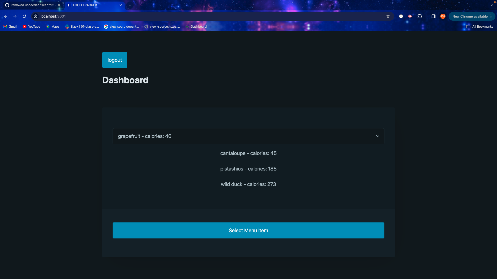

# Food-Tracker

## Name
 Food-Tracker

## Description
An application for planning meals and generating a calorie count depending on the food type chosen.

## Links
[Deploy from Heroku](https://afternoon-depths-27329-136310a7316d.herokuapp.com/)

## Usage
Created to receive user log-in information and food type chosen, and then output a calorie count into a display with details. All of the user inputs will save until user is replaced.  Sign-up page lets new users create account.

## Screenshot

